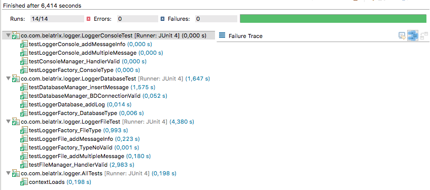
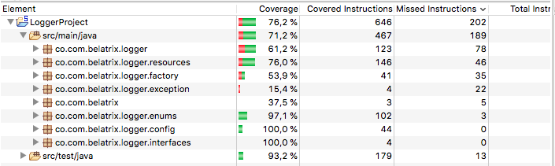

Code Review / Refactoring exercise
----------------------------------

Please review the following code snippet. Assume that all referenced assemblies have been properly included. 

The code is used to log different messages throughout an application. We want the ability to be able to log to a text file, the console and/or the database. Messages can be marked as message, warning or error. We also want the ability to selectively be able to choose what gets logged, such as to be able to log only errors or only errors and warnings. 

If you were to review the following code, what feedback would you give? Please be specific and indicate any errors that would occur as well as other best practices and code refactoring that should be done. 

Rewrite the code based on the feedback you provided in question 1. Please include unit tests on your code.

[JobLogger.java](JobLogger.java)

Feedback
--------

1. Violation of SOLID principles, for example:
    1. Single responsibility principle (SRP): Only JAVA file that does everything.
    2. Open/closed principle (OCP): It is not designed to be extended.
2. Complexity method signature (multiple Boolean values and little descriptive)
3. Complexity of understanding code
4. Difficult maintainability
5. Easy to inject errors in the code.
6. Monolithic functionality: By modifying something, others will probably stop working.
7. The names of some variables are not very descriptive.
8. Failure to follow principles of object-oriented development, design patterns, clean code.

Rafactoring
-----------

1. Implementation of design patterns and good practices of OOP. (Singleton, factory pattern...)
2. Make use of recommendations of principles and best practices exposed by Robert C. Martin for the generation of quality code.
    1. Class names, variable names and methods names more descriptive.
    2. Uncoupled components.
    3. Exception handling.
    4. Unit tests and integration tests
3. Verification of static code. 
4. Parameterizable configurations and open to the extension.
5. Implementation of customized and unchecked exceptions.

Unit tests and integration tests
--------------------------------

Evidence of unit and integration tests performed:

Coverage of the tests and number of lines tested, using the Coverage tool:

Technical aspects
-----------------

1. Implementation done in Java 8
2. Unit tests with JUnit
3. Maven Project
4. Code analysis with Sonarqube
5. Embedded database H2
6. Java Code Coverage Tools.